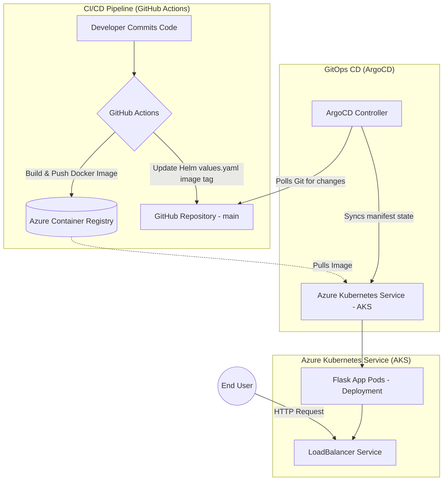
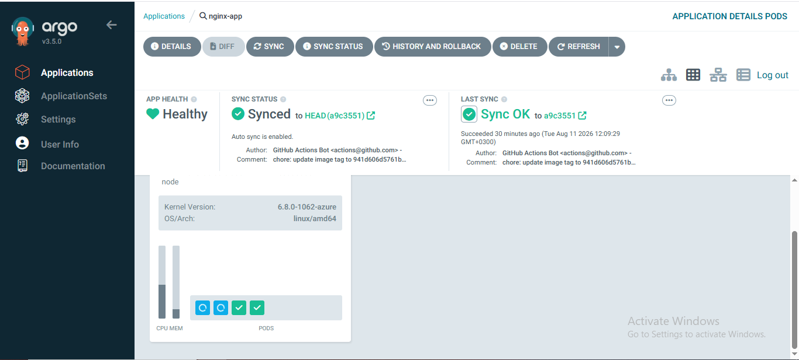
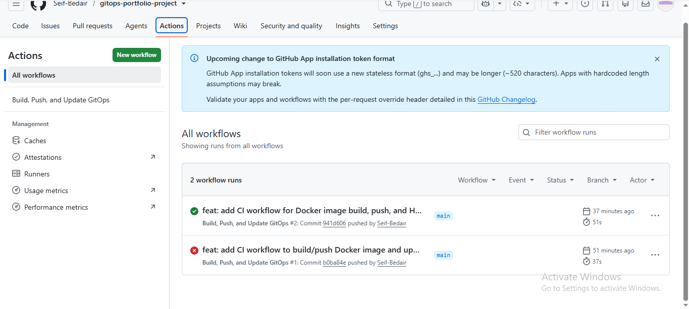
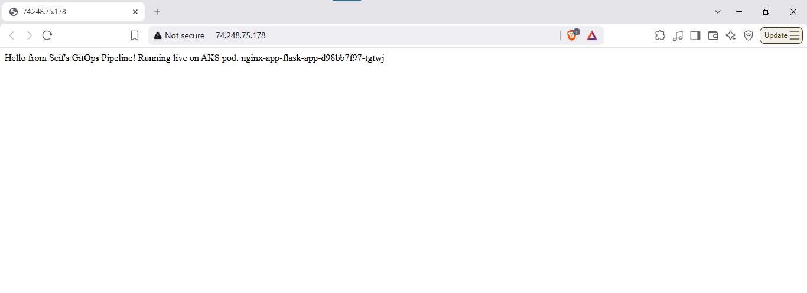

# GitOps & Kubernetes Cloud Engineering Portfolio

## Project Overview & Objectives

This repository demonstrates a production-grade, end-to-end GitOps deployment pipeline and immutable infrastructure provisioning. Designed to showcase modern cloud-native engineering practices, the project leverages Infrastructure as Code (IaC) to provision Azure resources and implements a zero-touch, automated continuous deployment model.

**Key Objectives:**
- **Immutable Infrastructure:** Automate the provisioning of Azure Kubernetes Service (AKS) and Azure Container Registry (ACR) using Terraform, ensuring repeatable and consistent environments.
- **GitOps Methodology:** Use ArgoCD as a continuous delivery controller that pulls declarative infrastructure and application state directly from Git, ensuring the cluster matches the repository at all times.
- **Zero-Downtime Automation:** Implement a robust CI/CD workflow using GitHub Actions to automatically build, containerize, and push code changes, triggering rolling updates in the Kubernetes cluster.
- **Scalability & Resiliency:** Deploy a highly available microservice (Python/Flask) managed via Helm and exposed securely using an Azure LoadBalancer.

---

## Architecture Diagram



---

## Tech Stack Matrix

| Category | Tool / Technology | Role in Project |
| :--- | :--- | :--- |
| **Cloud Provider** | Azure | Hosting the managed Kubernetes cluster and private container registry. |
| **Infrastructure as Code** | Terraform | Provisioning AKS, ACR, and handling Azure role assignments. |
| **Containerization** | Docker | Packaging the Python/Flask application into a lightweight, portable image. |
| **Orchestration** | Kubernetes | Managing the deployment, scaling, and networking of the containerized app. |
| **Package Management** | Helm | Templating Kubernetes manifests for flexible and dynamic deployments. |
| **Continuous Integration** | GitHub Actions | Automating the build, test, and registry push processes on code commits. |
| **Continuous Deployment** | ArgoCD | Enforcing GitOps by polling the repo and reconciling cluster state continuously. |
| **Application** | Python / Flask | Serving as the lightweight backend web service. |

---

## Repository Structure

```text
.
├── .github/
│   └── workflows/
│       └── ci.yml                  # GitHub Actions CI pipeline
├── docs/
│   └── images/                     # Architecture diagrams and execution screenshots
├── k8s/
│   ├── app/                        # Raw Kubernetes manifests for the application
│   │   ├── deployment.yaml
│   │   └── service.yaml
│   ├── argocd/                     # ArgoCD installation manifests
│   │   └── install.yaml
│   └── helm/
│       └── flask-app-chart/        # Helm chart for dynamic application deployment
│           ├── Chart.yaml
│           ├── values.yaml
│           └── templates/
├── terraform/                      # Infrastructure as Code (Terraform)
│   ├── main.tf                     # Azure resources (AKS, ACR) provisioning
│   ├── outputs.tf                  # Exported configuration values
│   ├── providers.tf                # Azure provider configuration
│   └── variables.tf                # Parameterized variables
├── app.py                          # Flask application source code
├── Dockerfile                      # Container build instructions
└── README.md                       # Project documentation
```

---

## CI/CD Pipeline Workflow

The automation pipeline ensures that every commit to the `main` branch seamlessly flows into the production cluster:

1. **Source Code Modification:** A developer modifies the Python application or Helm configurations and pushes to the `main` branch.
2. **Continuous Integration (GitHub Actions):** 
   - The workflow authenticates with Azure.
   - Builds a new Docker image containing the updated code.
   - Tags the image with the unique Git commit SHA.
   - Pushes the image to the private Azure Container Registry (ACR).
3. **Manifest Update:** The CI pipeline uses `sed` to update the `k8s/helm/flask-app-chart/values.yaml` file with the newly generated image tag and pushes the commit back to the repository.
4. **Continuous Deployment (ArgoCD):** 
   - ArgoCD detects a state divergence between the Git repository and the AKS cluster.
   - It automatically initiates a synchronization process.
   - The cluster pulls the new image from ACR and orchestrates a rolling update to the pods without dropping traffic.

---

## Key Visuals / Screenshots

*Documenting the deployment lifecycle and successful state.*

| ArgoCD Synchronization |
| :---: |
|  |
| *ArgoCD showing a healthy, synced application state.* |

| CI Pipeline Execution | Application Live |
| :---: | :---: |
|  |  |
| *GitHub Actions successfully building and pushing the image.* | *The Flask application responding via the Azure LoadBalancer.* |

---

## Deployment & Local Setup Guide

### Prerequisites

- [Azure CLI](https://docs.microsoft.com/en-us/cli/azure/install-azure-cli) configured and authenticated (`az login`).
- [Terraform](https://www.terraform.io/downloads.html) installed.
- [kubectl](https://kubernetes.io/docs/tasks/tools/) installed.
- [Helm](https://helm.sh/docs/intro/install/) installed.

### 1. Provision Infrastructure

Navigate to the Terraform directory and apply the configuration to spin up the AKS cluster and ACR.

```bash
cd terraform
terraform init
terraform plan
terraform apply -auto-approve
```

Retrieve the Kubernetes configuration:

```bash
az aks get-credentials --resource-group $(terraform output -raw resource_group_name) --name $(terraform output -raw kubernetes_cluster_name)
```

### 2. Install ArgoCD

Install ArgoCD directly into the AKS cluster:

```bash
kubectl create namespace argocd
kubectl apply -n argocd -f k8s/argocd/install.yaml
# Or use the official manifest:
# kubectl apply -n argocd -f https://raw.githubusercontent.com/argoproj/argo-cd/stable/manifests/install.yaml
```

Access the ArgoCD UI (port-forwarding):

```bash
kubectl port-forward svc/argocd-server -n argocd 8080:443
```
Retrieve the initial admin password:
```bash
kubectl -n argocd get secret argocd-initial-admin-secret -o jsonpath="{.data.password}" | base64 -d
```

### 3. Deploy the Application (GitOps)

Create the ArgoCD Application manifest to point to your repository's Helm chart (make sure to replace the `repoURL` with your actual repository URL):

```yaml
# k8s/argocd/application.yaml
apiVersion: argoproj.io/v1alpha1
kind: Application
metadata:
  name: flask-app
  namespace: argocd
spec:
  project: default
  source:
    repoURL: 'https://github.com/YOUR_USERNAME/YOUR_REPOSITORY.git'
    path: k8s/helm/flask-app-chart
    targetRevision: HEAD
  destination:
    server: 'https://kubernetes.default.svc'
    namespace: default
  syncPolicy:
    automated:
      prune: true
      selfHeal: true
```

Apply the application manifest:

```bash
kubectl apply -f k8s/argocd/application.yaml
```

### 4. Verification

Verify that the LoadBalancer has assigned an external IP:

```bash
kubectl get svc -l app.kubernetes.io/name=flask-app
```

Navigate to the external IP in your browser to see the running Flask application!
